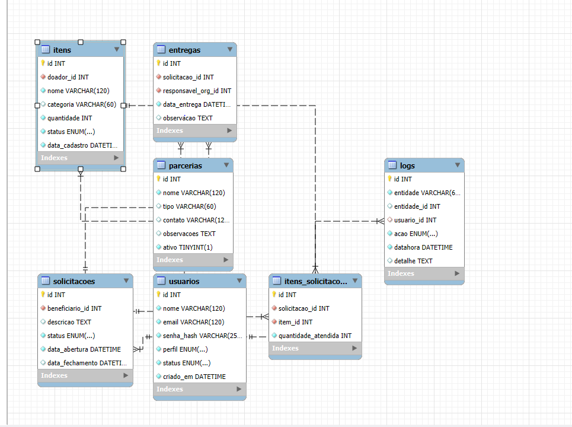

# Plataforma de Doações — Atividade 1: Documentação Inicial

**Autor:** Rafael Almeida  
**Disciplina:** Tema Integrador III — Projeto de Sistemas (Extensionista)  
**Professora:** Denise Moraes  
**Instituição:** UNIG  
**Local e Ano:** Rio de Janeiro — RJ, 2025

## 1. Organização do Projeto no GitHub
A pasta `docs/` centraliza requisitos, diagramas e relatório conforme solicitado na Atividade 1.

## 2. Requisitos Funcionais (RF)
Ver `docs/requisitos/RF.md` (RF01…RF10).

## 3. Requisitos Não Funcionais (RNF)
Ver `docs/requisitos/RNF.md` (RNF01…RNF08).

## 4. Regras de Negócio (RB)
Ver `docs/requisitos/RegrasNegocio.md` (RB01…RB06).

## 5. Diagramas
**Figura 1 – Diagrama de Caso de Uso da Plataforma de Doações.**  
 

**Figura 2 – Diagrama de Classes da Plataforma de Doações.**  
_  

**Figura X – DER (Modelo Lógico) da Plataforma de Doações.**  
 

